Game Night on 20220805

More game stats in individual md files showed above in the git repo.

# Night Overall
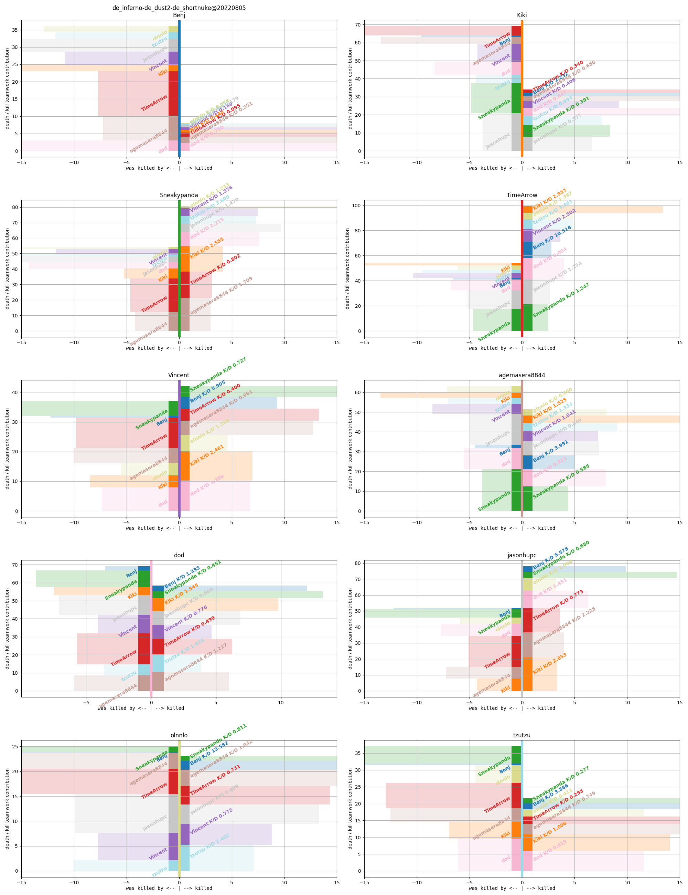
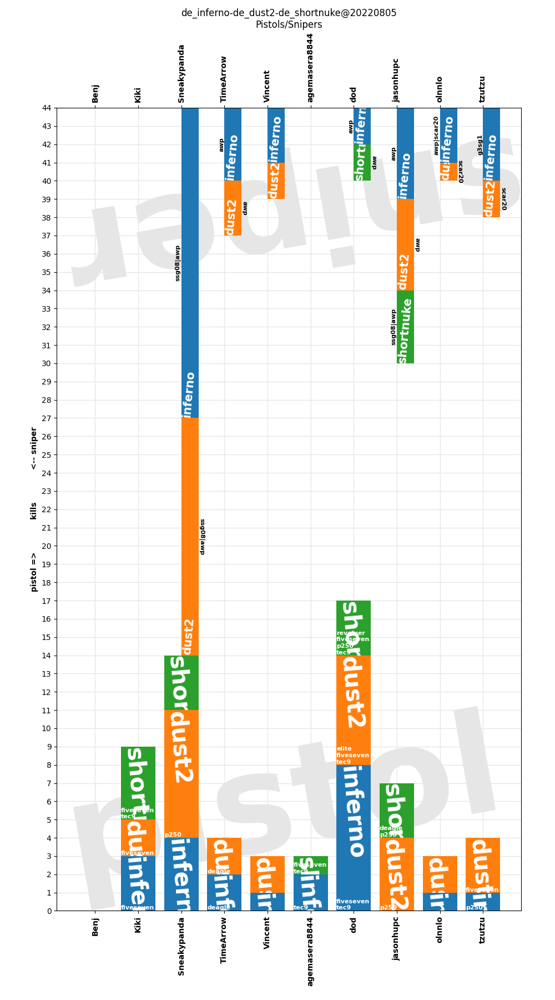
# Game-wise
## 20220805_221143_de_inferno_round30_score_15_15
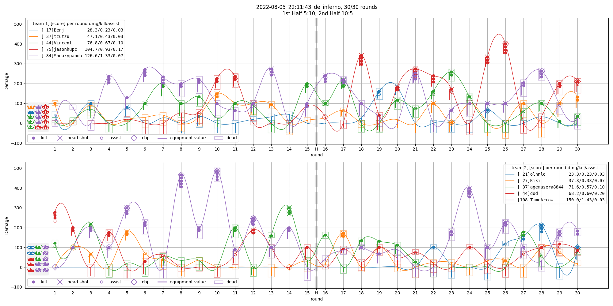
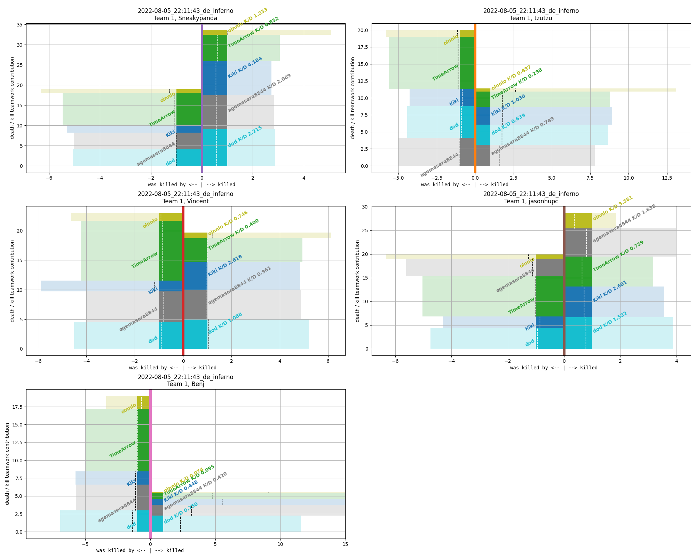
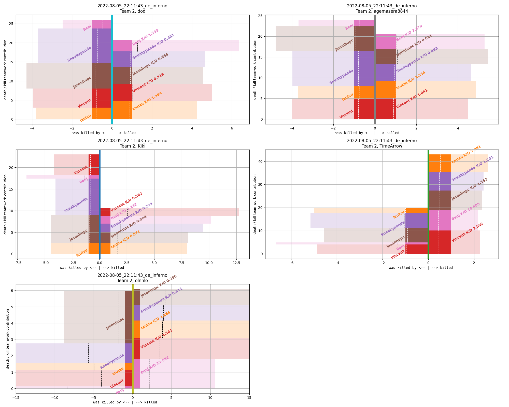
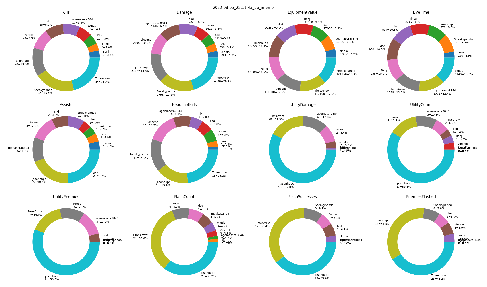
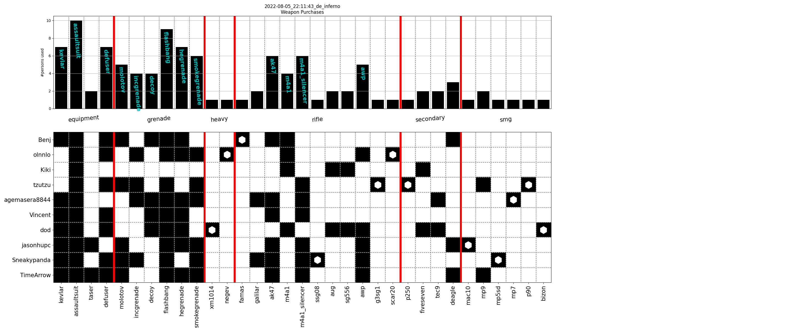
## 20220805_224406_de_dust2_round25_score_16_09
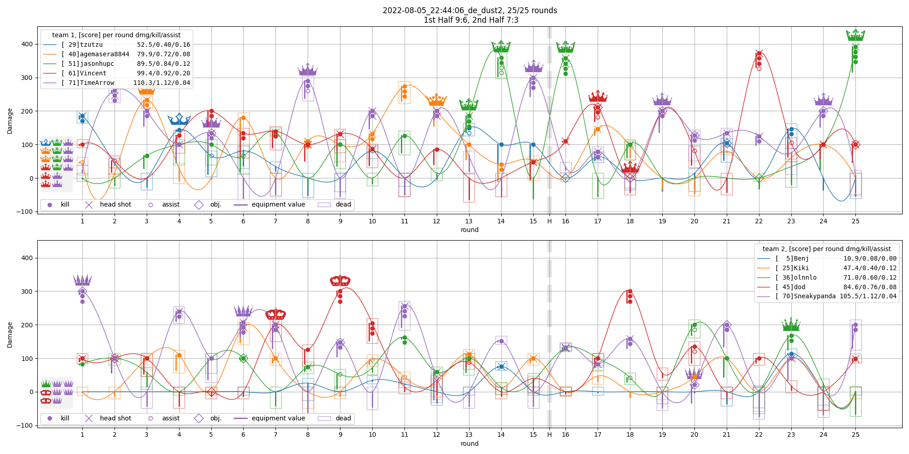
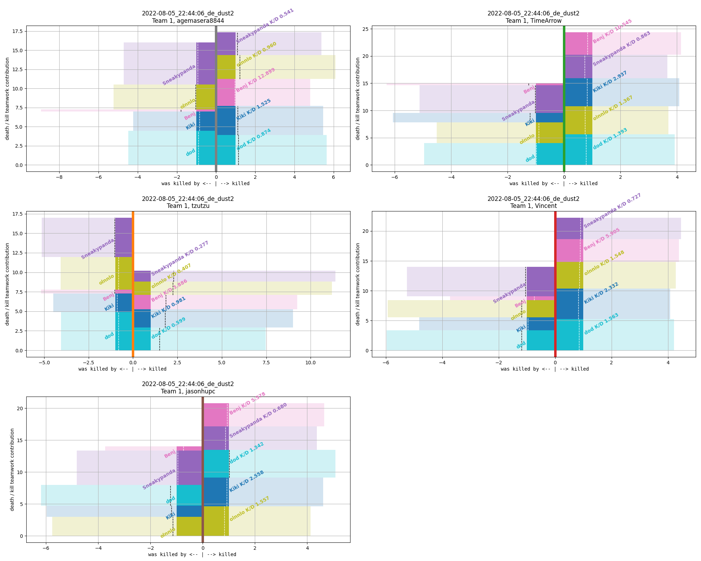
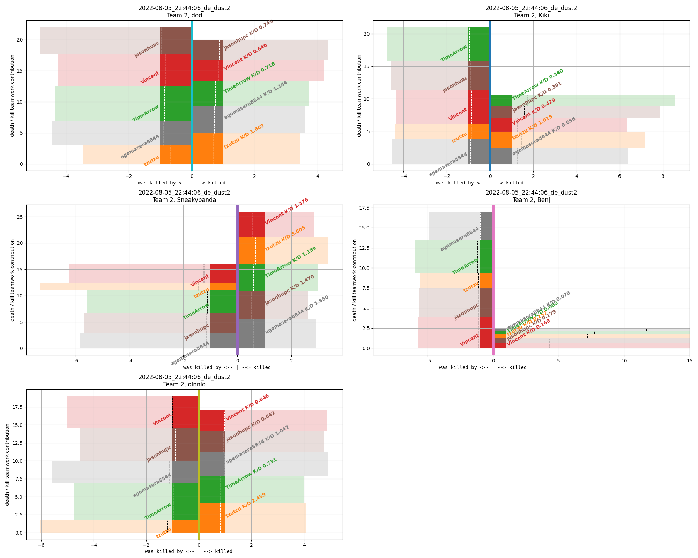
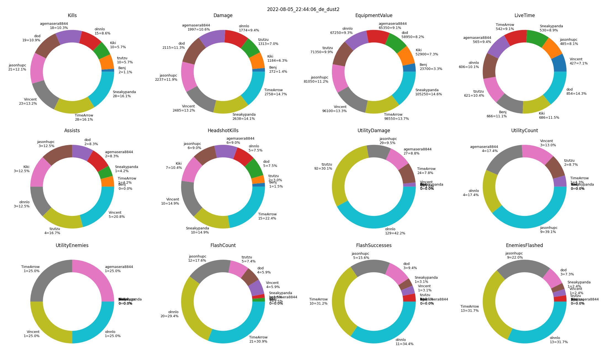
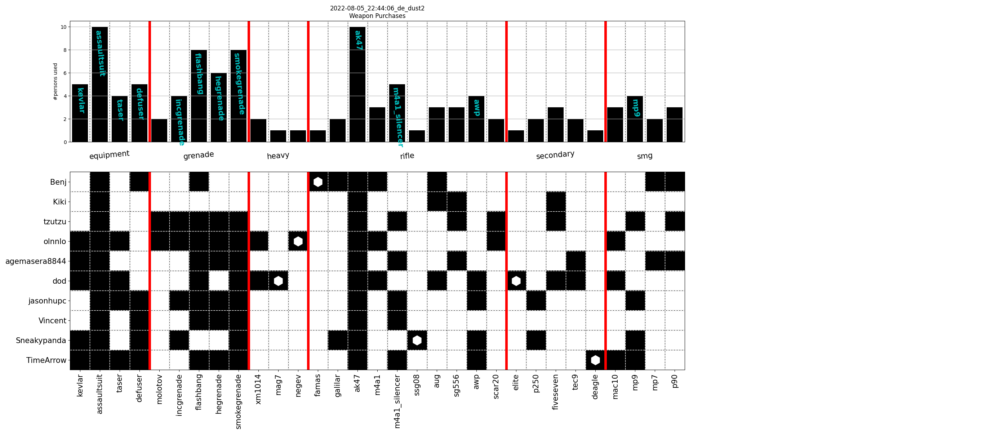
## 20220805_230801_de_shortnuke_round29_score_16_13
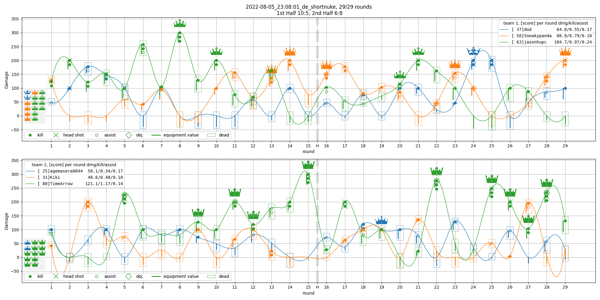
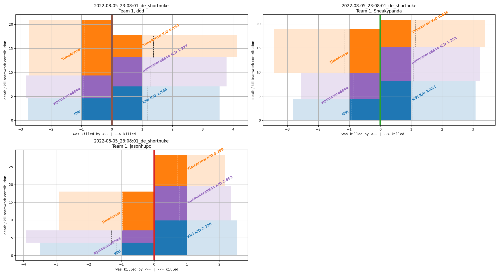
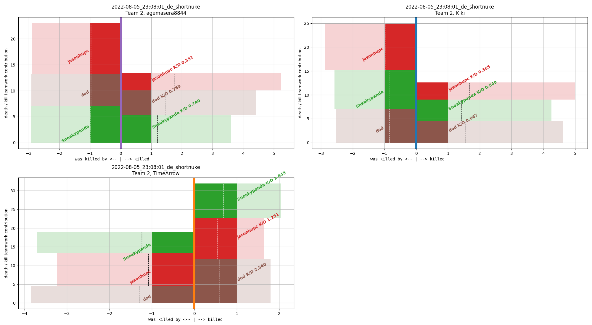
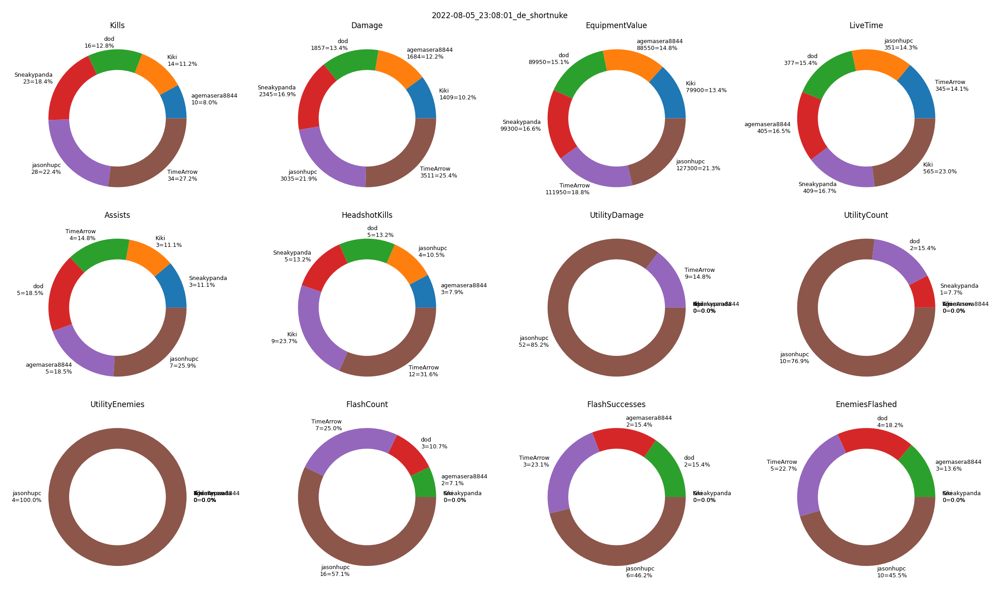
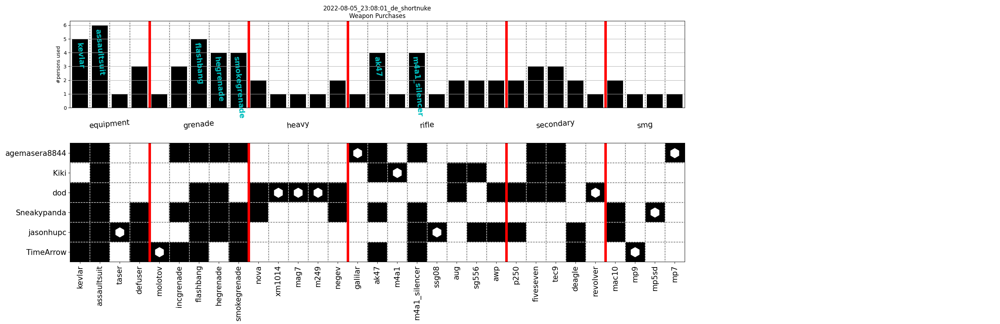
