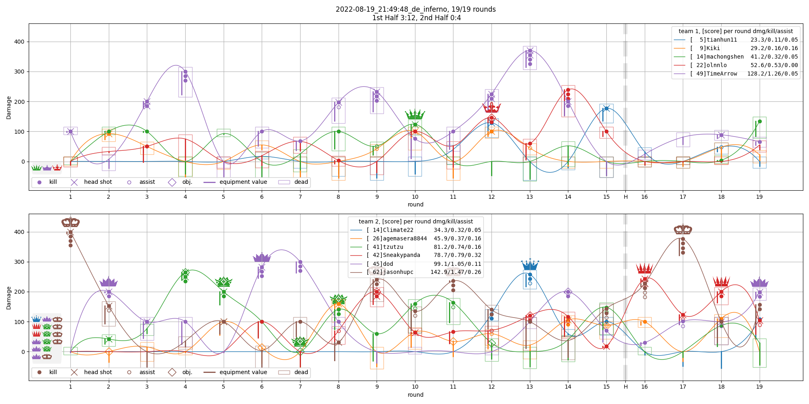
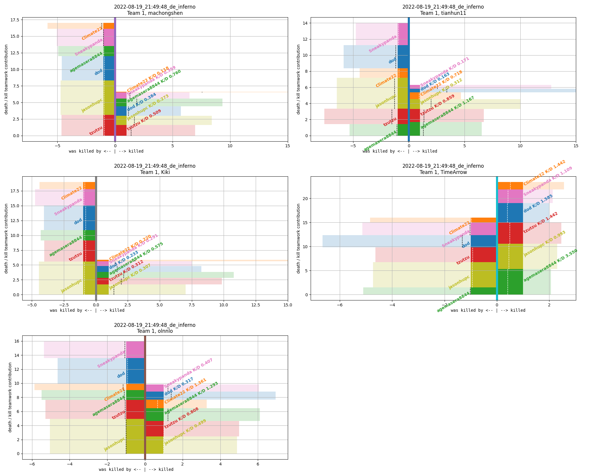
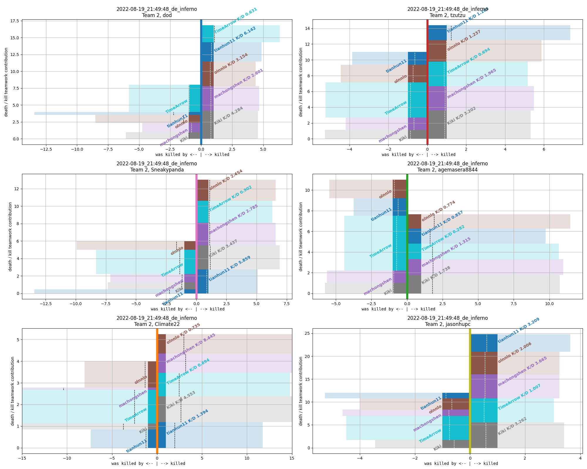
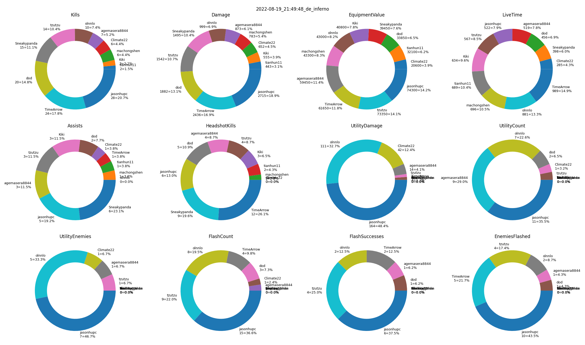
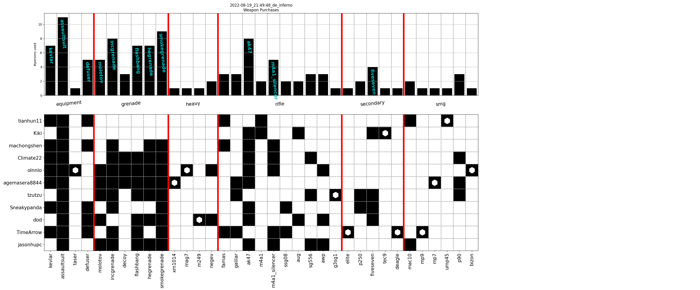

Game Night on 20220819

More game stats in individual md files showed above in the git repo.

# Night Overall

# Game-wise
## 20220819_212021_de_shortnuke_round23_score_16_07

## 20220819_214948_de_inferno_round19_score_03_16

## 20220819_223205_de_dust2_round30_score_14_16

## 20220819_231412_de_nuke_round30_score_14_16

